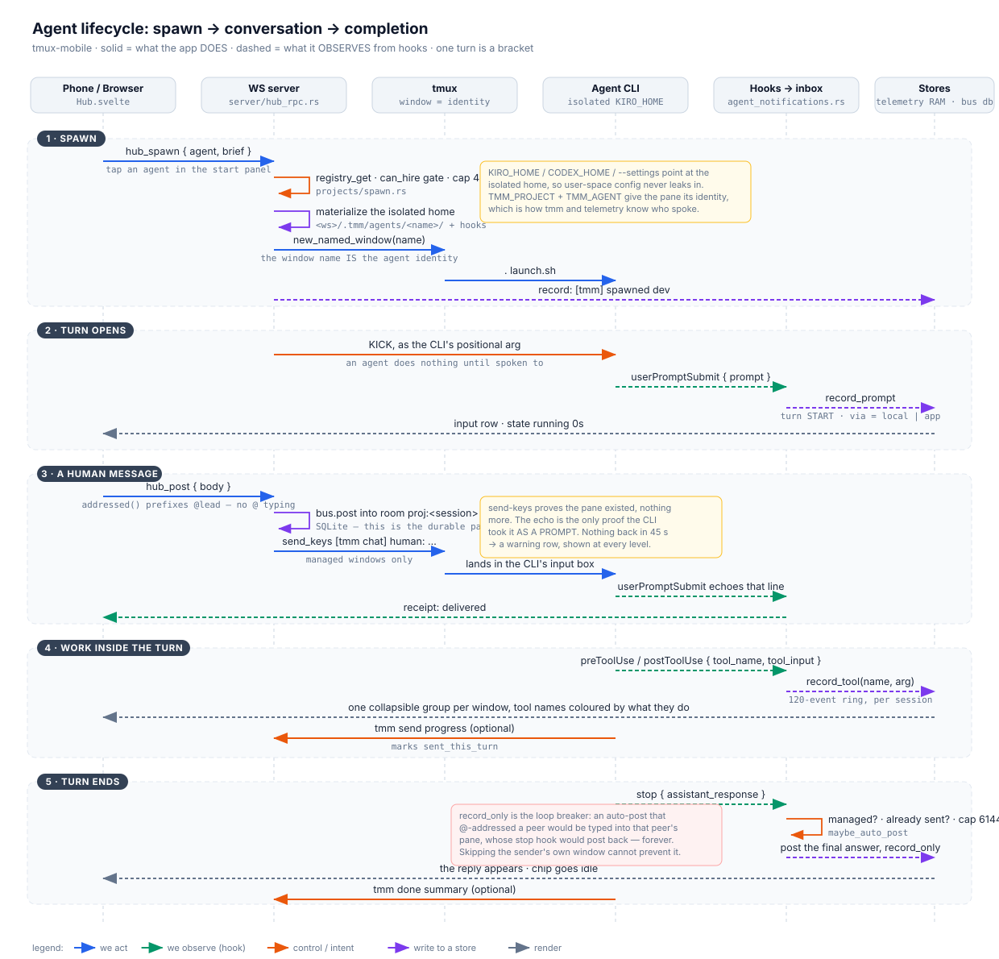
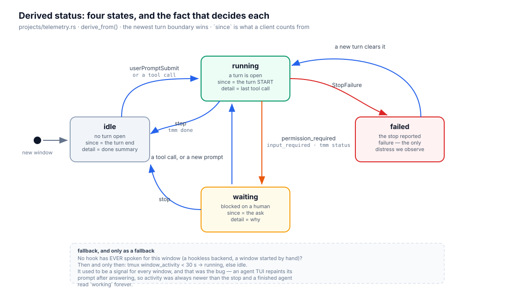

# Agent lifecycle: spawn → conversation → completion

One agent, end to end: how it gets started, how a message reaches it, how its
work becomes visible, and how a turn ends. Written by reading the code, so every
claim below points at a function you can open.

中文版：[`agent-lifecycle.zh.md`](agent-lifecycle.zh.md).

Two companions, and neither repeats the other:
[`tmm-cli.md`](tmm-cli.md) is the reference for each piece (commands, RPCs, the
CLI contract); this document is the *sequence*, and the place where the
invariants that span several pieces are written down.

The one distinction to carry through the whole document: **what the app DOES**
(it spawns, it types, it posts) and **what the app OBSERVES** (hooks fire, and we
read them). Every state the UI shows comes from the second half; the first half
never gets to assert anything about the agent.

## 1 · Spawn

`hub_spawn` → `projects::spawn::spawn()` (`projects/spawn.rs`).

| Step | What it does | Why it is here |
|---|---|---|
| `registry_get(agent)` | loads the definition | an agent is a registry row, not a command line |
| `can_hire` gate | an agent asking to spawn must be allowed to | a lead can hire; a worker fanning out is a bug |
| cap `SPAWN_CAP = 8` | counts agent windows in the session | each window burns real tokens |
| window name | `dev`, `dev-2`, … | **the window name IS the agent identity** — telemetry, `tmm`, delivery and the managed gate all key on it |
| `agent_home()` | `<ws>/.tmm/agents/<name>/` | the isolated home. `KIRO_HOME` / `CODEX_HOME` / `--settings` point here, so user-space config never leaks in — and this directory is also the *definition* of "an agent this app created" (`projects::managed_home`) |
| `render_kiro/claude/codex` | config + hooks + MCP + skills | hooks are written here; `refresh_hooks` rewrites them on every later start |
| `write_launch_recipe` | `launch.json` in the home: env + identity command, kick stripped | **a restart replays the FULL identity.** Without it the restart ran the bare backend line (`kiro-cli chat --resume-id …` — no `KIRO_HOME`, no `--agent`), i.e. the user-space config whose hooks never fire: the agent kept answering but went observably deaf — no tool rows, no auto-post, every delivery "unconfirmed" (owner report 2026-08-18). `relaunch_line` = recipe env + identity cmd + resume flag; `refresh_hooks` backfills the recipe for pre-recipe kiro agents |
| `new_named_window` + `. launch.sh` | starts the CLI | the command is sourced from a script, never `send-keys`'d: a tty shim swallows bursts ≳2 KB |
| `bus.post` | `[tmm] spawned dev — brief` | the room is the record |

The environment the pane gets — `TMM_PROJECT` (the session) and `TMM_AGENT` (the
window name) — is the whole of `tmm`'s identity story. There is no registration
call and no handshake.

## 2 · The turn opens

An agent CLI boots into an interactive prompt and does **nothing** until spoken
to. The brief in the system prompt is context; the starter pistol is `KICK`
passed as the CLI's positional argument (`spawn.rs`).

That first prompt is also the first thing we observe: `userPromptSubmit` fires,
the helper writes an envelope into the inbox, and `consume_file`
(`agent_notifications.rs`) turns it into `telemetry::record_prompt`, which
opens the turn. From this moment the chip reads `running 0s`.

## 3 · A human message

`hub_post` (`server/hub_rpc.rs`) does two separable things, and conflating them
was a bug we already paid for:

1. **Record.** `bus.post` into room `proj:<session>` — SQLite, and the only
   durable part of this whole document.
2. **Deliver.** `deliver_mentions` types `[tmm chat] <from>: <body>` into each
   addressed agent's pane, because an interactive CLI reacts to its INPUT, not to
   a database. Managed windows only: `@all` must never type into a kiro the user
   started by hand.

Three recipients, three different costs — a name interrupts one agent, `@all`
interrupts everyone, and no recipient interrupts nobody (the room keeps it for
their next `tmm log`).

The typed line carries local wall time (`[tmm chat 2026-08-17 16:31] human: …`)
for the reader's sake: a CLI resuming a conversation cannot recover *when*
something was said — its clock only tells it `now`. The spawn KICK is stamped for
the same reason, and the system prompt deliberately is NOT: it is replayed on
every restore, so a baked-in date becomes a lie.

Then the half that makes delivery honest: `send-keys` succeeding proves the pane
existed. The proof that the CLI accepted the text *as a prompt* is that the
agent's own `userPromptSubmit` echoes the line back — `record_delivery` holds it
pending, `record_prompt` matches and clears it (containment, since a busy agent
submits our line with its own half-typed text attached), and the UI marks the
message **delivered**. Nothing back within `DELIVERY_ACK_SECS = 45`?
`sweep_deliveries` reports it as a warning, at every detail level, because it is
about a message the user sent.

## 4 · Work inside the turn

`preToolUse` / `postToolUse` → `tool_event_parts()` → `record_tool(name, arg)`.
The name and the argument travel apart all the way to the client, so the name can
be the coloured, scannable column and nobody has to re-split a string on a space
that a path or a shell command can contain.

The client (`hub.ts::feedBlocks`) folds a window's consecutive tool events into
one collapsible group; a message, a status declaration or a lifecycle event ends
the run, which is what makes a group mean *between these two replies*. The
agent's own `tmm send/status/done/log/spawn` calls are filtered out
(`isSelfReport`): their effect is already a row.

Ordering is not free, and it took three things: the inbox is consumed in
filename order (an event is stamped when consumed, so consume order IS render
order), timestamps are real milliseconds, and a genuine tie puts the observation
before the message (a reply is what ends a turn).

## 5 · The turn ends

`stop` carries `assistant_response` — measured on kiro-cli 2.16.2, and the only
hook that carries the agent's answer. `maybe_auto_post` posts it to the room
under four gates, each of which exists because of a specific failure:

1. **Managed only** (`managed_home`) — otherwise a hand-started kiro starts
   posting into project rooms.
2. **Not already sent this turn** — an agent that called `tmm send` would
   otherwise produce two messages for one turn. The flag is reset by
   `userPromptSubmit`, which is why that hook must exist in every config that can
   auto-post. `tmm done` deliberately does NOT set it: its summary is a report
   ABOUT the work while the stop hook carries the answer itself, and treating
   done as send made every turn ending in the REQUIRED done lose its final reply
   (owner, 2026-08-21). The summary is recorded instead, and the auto-post is
   skipped only when the reply IS the summary verbatim — the one real duplicate.
3. **`record_only = true`** — an auto-post whose body addresses a peer would be
   typed into that peer's pane, whose stop hook would post back. Forever.
4. **`MAX_REPLY_CHARS = 6144`** — the chat budget, not the 240-char notification
   budget.

`tmm done` remains a state transition (and ends the turn explicitly); its summary
can be one line, because the answer itself still auto-posts to the room.

**And the summary reports UP the spawn edge** (owner, 2026-08-29): `tmm spawn`
records `spawned_by` in the launch recipe, and `hub_done` delivers a non-empty
summary into the live managed spawner's pane (`[tmm chat <ts>] <name>:
[done] 
`, same delivery bookkeeping as an @mention). Every other
completion channel is record-only, so a lead that spawned two builders never
learned they finished. Targeted — one line, one pane, once per turn end, and
the chain terminates at the human — so it cannot ping-pong; invariants 2 and 3
above are untouched.

**A turn cancelled from OUTSIDE has no edge of its own**: interrupt
(`hub_agent_interrupt` / the composer's armed empty-send / `tmm agent
interrupt`) resets the derived state FIRST (`record_interrupt`: end =
completed-now, ask and the explicit claim cleared → `idle` immediately), then
types the named `Escape` into the pane. Without the reset the newest fact
stays the `userPromptSubmit` that opened the cancelled turn and the card reads
`running` for as long as the agent lives (owner, 2026-08-29).

## Status: four states, one rule

The rule is "which turn boundary is the newest fact", and `since` is what a
client counts from — for `running` it is the turn's START, so "running 2m14s" is
the turn's age. `tmm status` is trusted only for what we cannot observe (blocked
on a credential, on an answer, on another agent); a claim of `working` sets no
state and contributes only its note.

## What survives what

| | in-process restart | server restart | reboot |
|---|---|---|---|
| Chat messages (`bus`, SQLite `team.db`) | ✅ | ✅ | ✅ |
| Project + agent slots + resume ids (`state.db`) | ✅ | ✅ | ✅ |
| Isolated homes, hooks, prompts (`<ws>/.tmm/agents/`) | ✅ | ✅ | ✅ |
| Per-window conversation-id memory | ✅ | ❌ (re-learned from the next hook) | ❌ |
| Telemetry: tool rows, prompt rows, warnings | ✅ | ❌ | ❌ |
| `sent_this_turn`, pending deliveries | ✅ | ❌ | ❌ |
| The agent process itself | ✅ (tmux outlives us) | ✅ | ❌ |

The asymmetry in the last three rows is the honest summary of this design: **the
conversation is durable, the observation is not.**

One more thing does NOT survive that the table cannot show: a **running CLI's
config**. The CLI reads it once at launch, so `refresh_hooks` patching the disk
repairs the *next* start, never the current process — an agent started before a
hook existed keeps missing it until restarted (this is exactly how the
2026-08-18 "unconfirmed" report began: a lead running since before the
`userPromptSubmit` hook was added).

## Open issues found while writing this

Ordered by how much they can mislead a user.

1. **A prompt change never reaches an agent that already exists.**
   `refresh_hooks` repairs hooks on every start, deliberately touching nothing
   else — but the system prompt carries the brief, which cannot be rebuilt, so an
   agent spawned last week still carries last week's instructions (including the
   old "announce that you are working" line). Fix needs the brief stored on the
   slot so the prompt can be re-rendered. *(Related but fixed 2026-08-18: a
   restart now replays the full launch identity via the persisted recipe —
   hooks-current config, isolated home, resume id. The brief staleness above is
   what remains.)*
2. **Telemetry dies with the server** (table above). After a restart the messages
   are there and the work around them is gone, which reads as "the agent answered
   out of nowhere". A persisted ring in `state.db` would fix it; the 120-event cap
   would then be a retention policy rather than a memory bound.
3. **A warning can appear far from the message it is about.**
   `sweep_deliveries` runs when a client polls and stamps the warning with
   `now_ms()`, not with the pending line's own timestamp — so an unacked message
   from ten minutes ago produces a row that sorts *now*. It should carry the
   pending line's timestamp.
4. **Only one delivery can be pending per window.** `Rec.pending` is a single
   slot: two `@mentions` to the same agent in quick succession silently drop the
   first receipt, so the first message never shows delivered and never warns. It
   wants a small queue.
5. **Telemetry is keyed by window INDEX while identity is the window NAME.** With
   tmux `renumber-windows on`, killing a window shifts indices and a record can
   attach to a different agent. Key by name, or verify the name on read.
6. **The spawn cap counts windows that are not ours.** `SPAWN_CAP` counts any
   agent-looking window, so a kiro the user started by hand in the project
   session eats one of the four slots.
7. **A rename between hook and consume loses the post.** `maybe_auto_post`
   resolves the window name at consume time; if the window was renamed in that
   250 ms the managed gate fails and the reply is dropped with no warning.
8. **Delivery has no backpressure.** A message is typed into a pane whether or
   not the agent is mid-turn. It works because the CLIs queue input, not because
   anything here guarantees it.
9. **Identical bodies confuse the receipt.** `feedBlocks` matches an echo to a
   message by containment, so sending the same text twice marks only the later
   one delivered.
10. **`TeamRoomPoster` ignores `record_only`.** It is safe today because that impl
    never delivers, but the invariant lives in a comment instead of in the type —
    a second implementation would have to rediscover it.
