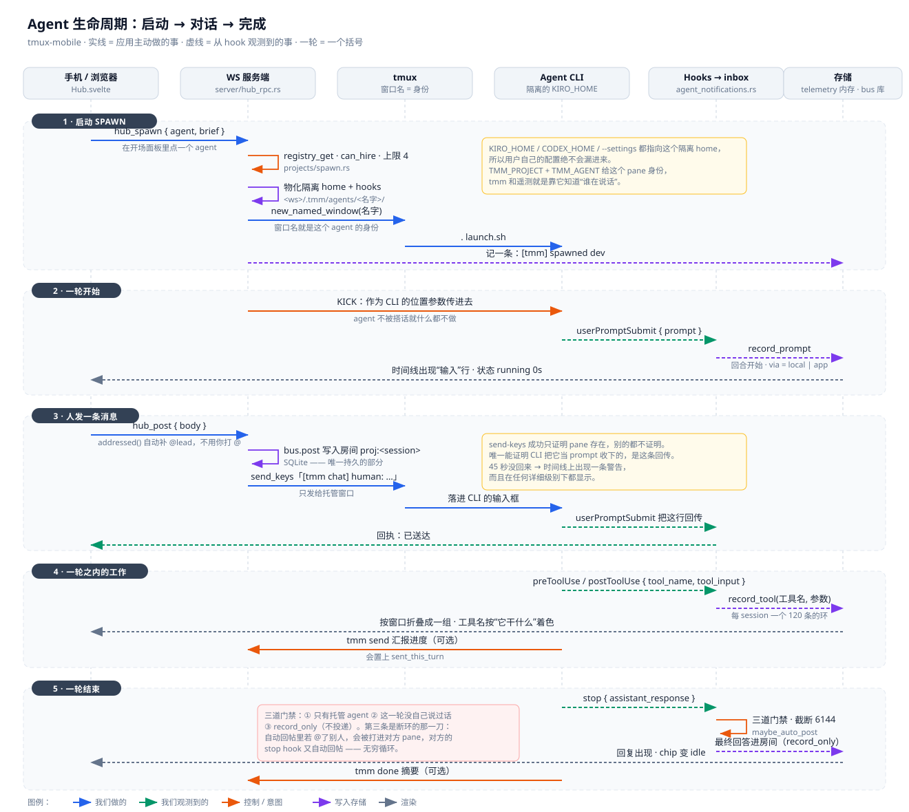
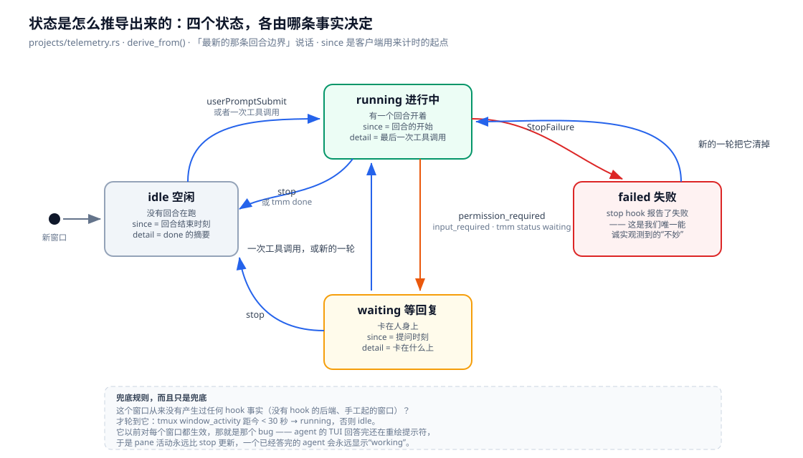

# Agent 生命周期：启动 → 对话 → 完成（中文版）

一个 agent 从头到尾：怎么被起来、一条消息怎么真的送到它手里、它干的活怎么变成
你能看见的东西、一轮怎么结束。这份文档是读代码写的，每句话都能指到一个函数。

英文版：[`agent-lifecycle.md`](agent-lifecycle.md)。逐条参考（命令、RPC、CLI 约定）
在 [`tmm-cli.md`](tmm-cli.md)；这份讲的是**顺序**，以及那些"只存在于几个模块之间"
的不变量。

贯穿全文的一个区分：**应用做的事**（spawn、往 pane 里打字、往房间里写）和
**应用观测到的事**（hook 触发，我们去读）。UI 上显示的每一个状态都来自后者；
前者从来没有资格断言 agent 处于什么状态。

## 1 · 启动

`hub_spawn` → `projects::spawn::spawn()`（`projects/spawn.rs`）。

| 步骤 | 做什么 | 为什么在这儿 |
|---|---|---|
| `registry_get(agent)` | 读出定义 | 一个 agent 是注册表里的一行，不是一条命令 |
| `can_hire` 门禁 | agent 想 spawn，得它自己的定义允许 | lead 可以拉人；worker 到处分身是 bug |
| 上限 `SPAWN_CAP = 4` | 数这个 session 里的 agent 窗口 | 每个窗口都在真烧 token |
| 窗口名 | `dev`、`dev-2`… | **窗口名就是 agent 的身份** —— 遥测、`tmm`、消息投递、托管门禁全都以它为键 |
| `agent_home()` | `<ws>/.tmm/agents/<名字>/` | 隔离 home。`KIRO_HOME` / `CODEX_HOME` / `--settings` 都指向这里，用户自己的配置漏不进来；这个目录同时也是"**这个 agent 是我们创建的**"的定义（`projects::managed_home`） |
| `render_kiro/claude/codex` | 配置 + hooks + MCP + skills | hooks 在这里写下；以后每次启动 `refresh_hooks` 都会重写它 |
| `new_named_window` + `. launch.sh` | 真正把 CLI 起来 | 启动命令是 source 一个脚本，绝不用 `send-keys` —— tty shim 会吞掉 ≳2 KB 的突发输入 |
| `bus.post` | `[tmm] spawned dev — brief` | 房间就是记录 |

给这个 pane 的环境变量 —— `TMM_PROJECT`（session）和 `TMM_AGENT`（窗口名）——
就是 `tmm` 全部的身份机制。没有注册调用，没有握手。

## 2 · 一轮开始

agent CLI 起来之后停在交互提示符上，**不被搭话就什么都不做**。system prompt 里
的 brief 是背景，真正的发令枪是作为 CLI 位置参数传进去的 `KICK`。

这第一句话同时也是我们观测到的第一件事：`userPromptSubmit` 触发 → helper 往
inbox 写一个信封 → `consume_file`（`agent_notifications.rs`）转成
`telemetry::record_prompt`，**回合从这一刻开开**。chip 从此显示 `running 0s`。

## 3 · 人发一条消息

`hub_post`（`server/hub_rpc.rs`）做两件可以分开的事——把它们混在一起，我们已经
付过一次代价了：

1. **记录。** `bus.post` 写入房间 `proj:<session>` —— SQLite，也是整篇文档里
   唯一持久的东西。
2. **投递。** `deliver_mentions` 把 `[tmm chat] <谁>: <正文>` 打进每个被 @ 到的
   agent 的 pane，因为交互式 CLI 只对**自己的输入**有反应，不会去读数据库。
   只发给托管窗口：`@all` 绝不能打进用户手工起的 kiro。

三种收件人，三种代价——一个名字打断一个 agent，`@all` 打断所有人，没有收件人
谁都不打断（房间替他们留着，等他们下次 `tmm log`）。

打进去的那行带**本地日期和时间**：`[tmm chat 2026-08-17 16:31] human: …`。这是给
读的那一方用的：CLI 读到这行时，这段对话可能已经空了几个小时，而"这句话是什么时候
说的"是它无法自己恢复的上下文——它自己的时钟只能告诉它"现在"。spawn 的 KICK 同理
也带了时间戳；而 system prompt **不带**，因为那段 prompt 每次窗口恢复都会重放，
写死一个日期几天后就是在说谎。`tmm log` 也改成渲染成同样的本地时间，而不是打印原始
的 epoch 毫秒——那个数字对 agent 来说什么都推不出来。

然后是让"投递"这件事变诚实的那一半：`send-keys` 成功只证明 pane 存在。证明 CLI
**把它当成了 prompt** 的唯一证据，是这个 agent 自己的 `userPromptSubmit` 把那行
回传回来 —— `record_delivery` 把它记成待确认，`record_prompt` 匹配上就清掉
（用包含匹配，因为正在打字的 agent 提交时会带上自己的残留文本），UI 上那条消息
标成**已送达**。`DELIVERY_ACK_SECS = 45` 秒还没回来？`sweep_deliveries` 报一条
警告，而且在任何详细级别下都显示——因为它讲的是用户刚发出去的那条消息。

## 4 · 一轮之内的工作

`preToolUse` / `postToolUse` → `tool_event_parts()` → `record_tool(名字, 参数)`。
名字和参数一路分开传到客户端，这样名字才能成为那一列带颜色、可以竖着扫下去的
东西，也省得客户端去猜哪个空格是分隔符（路径和 shell 命令里都有空格）。

客户端（`hub.ts::feedBlocks`）把同一个窗口连续的工具事件折成一组；一条消息、
一次状态声明或一个生命周期事件都会断开这个 run —— 这正是"一组 = 两次回复之间"
的含义。agent 自己的 `tmm send/status/done/log/spawn` 会被过滤掉
（`isSelfReport`）：它们的**效果本身**已经是一行了。

顺序不是免费的，需要三件事同时对：inbox 按文件名顺序消费（事件是**消费时**打
时间戳的，所以消费顺序就是渲染顺序）、时间戳是真毫秒、真出现平局时把观测排在
消息之前（回复是"结束这一轮"的那个动作）。

## 5 · 一轮结束

`stop` 带 `assistant_response` —— 在 kiro-cli 2.16.2 上实测过，也是唯一带着
agent 答案的 hook。`maybe_auto_post` 在四道门禁下把它发进房间，每一道都对应一个
具体的事故：

1. **只有托管 agent**（`managed_home`）—— 否则用户手工起的 kiro 会开始往项目
   房间里发东西。
2. **这一轮没自己说过话** —— 否则调用过 `tmm send` 的 agent 一轮会产生两条消息。
   这个标志由 `userPromptSubmit` 清零，所以那个 hook 必须存在于**每一个可能自动
   回帖的配置**里。
3. **`record_only = true`** —— 自动回帖的正文里如果 @ 了别人，那行会被打进对方的
   pane，对方的 stop hook 又会回帖。无穷循环。
4. **`MAX_REPLY_CHARS = 6144`** —— 聊天的预算，不是通知那 240 字的预算。

`tmm done` 仍然是一次状态转移（并且显式结束这一轮）；它的摘要可以只有一行，
因为答案本身已经在房间里了。

## 状态：四个状态，一条规则

规则就是"**哪条回合边界是最新的事实**"，而 `since` 是客户端计时的起点——
`running` 时它是这一轮的**开始**，所以"running 2m14s"说的是这一轮跑了多久。
`tmm status` 只在"我们观测不到"的地方被采信（卡在凭证、卡在一个回答、卡在另一个
agent 身上）；声称 `working` 不设置任何状态，只贡献它那句备注。

## 什么能活下来

| | 进程内重启 | 服务端重启 | 整机重启 |
|---|---|---|---|
| 聊天消息（`bus`，SQLite `team.db`） | ✅ | ✅ | ✅ |
| 项目 + agent 槽 + resume id（`state.db`） | ✅ | ✅ | ✅ |
| 隔离 home、hooks、prompt（`<ws>/.tmm/agents/`） | ✅ | ✅ | ✅ |
| 未读通知收件箱（`unread.json`） | ✅ | ✅ | ✅ |
| 遥测：工具行、输入行、警告 | ✅ | ❌ | ❌ |
| `sent_this_turn`、待确认投递 | ✅ | ❌ | ❌ |
| agent 进程本身 | ✅（tmux 比我们活得久） | ✅ | ❌ |

最后三行的不对称就是这套设计最诚实的总结：**对话是持久的，观测不是。**

## 梳理中发现的问题

按"能误导用户的程度"排序。

1. **prompt 的改动到不了已经存在的 agent。** `refresh_hooks` 每次启动都修 hooks，
   并且刻意不碰别的——但 system prompt 里带着那一次给的 brief，重建不出来。所以
   上周 spawn 的 agent 现在还揣着上周的指令（包括已经被删掉的"要宣布自己在工作"
   那句）。要修，得先把 brief 存到 slot 上。
2. **遥测随 server 一起死**（见上表）。重启之后消息在、产生它的工作没了，读起来
   像"agent 凭空答了一句"。落到 `state.db` 就能解决；那时 120 条上限就从内存约束
   变成保留策略。
3. **警告会出现在离它讲的那条消息很远的地方。** `sweep_deliveries` 是客户端拉取时
   才跑的，而且用 `now_ms()` 打时间戳，不是用那条待确认消息自己的时刻——所以十分钟
   前没送达的消息，会产生一条排在"现在"的警告。应该带上待确认那行的时间戳。
4. **每个窗口只能有一条待确认投递。** `Rec.pending` 是单个槽位：连着给同一个 agent
   发两条 @ 消息，第一条的回执被静默丢掉，于是它既不显示已送达也不报警。需要一个
   小队列。
5. **遥测用窗口索引做键，而身份是窗口名。** tmux 开了 `renumber-windows on` 时，
   杀掉一个窗口会让索引平移，记录可能挂到另一个 agent 上。应该按名字做键，或者读
   的时候校验名字。
6. **spawn 的上限把不属于我们的窗口也数进去。** `SPAWN_CAP` 数的是"看起来像 agent"
   的窗口，所以用户在项目 session 里手工起的 kiro 会占掉 4 个名额之一。
7. **hook 到消费之间改名会丢掉这次回帖。** `maybe_auto_post` 是在消费时解析窗口名
   的；如果窗口在那 250 毫秒里被改名，托管门禁不通过，回复被丢掉且没有任何提示。
8. **投递没有背压。** 不管 agent 是不是正在一轮里，消息都会被打进 pane。它能工作
   是因为这些 CLI 会把输入排队，而不是因为这里有任何保证。
9. **两条完全相同的正文会让回执认错人。** `feedBlocks` 用包含匹配把回声配到消息上，
   所以同样的话发两遍，只有后一条会被标成已送达。
10. **`TeamRoomPoster` 忽略 `record_only`。** 今天是安全的（那个实现从不投递），但
    这个不变量写在注释里而不是类型里——第二个实现者得重新发现它。
