# Team — multi-agent collaboration

> A letter to the next agent. This explains **why** the Team feature is shaped
> the way it is and the traps we avoided. Code comments cover the **how**.

## 1. What it is

The **Team** tab lets the human, from the phone, drop into a group chat with
several coding agents (Kiro / Claude Code / Codex) and coordinate them — and tap
any agent to preview its live tmux execution state in the Terminal tab.

### Architecture overview

The diagram below shows what runs where: the phone connects over WebSocket to the
desktop server, which hosts the in-process message bus and supervises one
**Kiro CLI** per agent inside a `tmm-team-<slug>` tmux session. Each agent runs
the same loop — `wait` → reason → execute real tools (heartbeat fires) →
`post` → loop back. The hooks (keepalive, heartbeat) and the supervisor's
self-heal mechanism keep the loop alive; external standalone agents can join
the same bus over HTTP MCP. Read this picture first; the prose below fills in
the rationale.




It is built on **agora**, an experimental group-chat message bus (originally a
standalone project at `~/agora`). agora is:

- An **append-only group chat** over SQLite. Everyone reads the same log.
- A **pull model**: agents call `wait` (blocking long-poll) to receive messages,
  `post` to speak. Addressing is by `@name` in the body; `requires_reply=true`
  makes the bus refuse an agent's `wait` until it answers (the "obligation
  graph"). Enforced in the bus, not per-agent — agent-agnostic.
- Served as an **HTTP MCP server** (`/mcp`) for agents (zero-touch: a role prompt
  + an `x-agent` header) plus a dashboard / SSE / JSON API for humans.

### Naming: "team" is ours, "agora" is the library

"agora" is the upstream project's codename. Everything **we** built and
everything the **user** sees is branded **Team** (the Team tab, `team_*` RPCs,
`TEAM_*` config, `tmm-team-*` tmux sessions, `team.rs`/`team_bridge.rs`,
`team/` scripts). The **vendored library crate keeps its real name `agora`**
(`src-tauri/crates/agora/`) — renaming a faithful third-party copy would only
obscure its origin. So `use agora::bus::Bus` inside `team_bridge.rs` is
deliberate; everything around it is `team`.

## 2. Integration shape — and why

The decisive choice: **vendor agora as an in-process, desktop-only sub-crate and
share ONE `Bus` between the agents' MCP daemon and the phone's WS server.**

```
                tmux-mobile desktop server (one process)
   ┌───────────────────────────────────────────────────────────┐
   │  agora::Bus  (SQLite + tokio::broadcast)                    │
   │     ├── agora::web::serve → axum :8787  /mcp + dashboard ───┼──► kiro/claude/codex agents
   │     ├── TeamBridge (JSON trait) ──► tmux-mobile WS server ──┼──► phone Team tab
   │     └── team::supervisor (in-process) ─────────────────────┼──► launches agents into tmux
   └───────────────────────────────────────────────────────────┘
        ▲ agents each run in their OWN named window of a
          per-workspace session: tmm-team-<workspace-slug>
```

**Launching is in-process** (`src-tauri/src/team.rs`): the phone's "Start team"
button calls `team_start_team` with a chosen **workspace** (the agents' working
dir), and the desktop server itself seeds the default roster onto the bus and
reconciles it into real agent windows in tmux — no separate script, no extra
process. The agent CLIs still run as their own tmux processes (intrinsic, and
what enables pane preview), but all orchestration lives in the app. (The team's
Python launcher that predated this Rust port has been retired — see §"Retired".)

Why this shape, and what was rejected:

- **In-process, not a separate daemon the phone HTTP-hops to.** The phone already
  has an authenticated, encrypted WS link to the desktop server. Routing team
  through it (a handful of `team_*` RPC methods + a `team_message` push) means
  **no second auth surface, no second port the phone must reach, no CORS, reuse
  of the existing E2E encryption + reconnect logic.** External agents still get
  the real MCP endpoint on `:8787` because the *same* `Bus` also runs agora's
  axum router. One room, two front doors.

- **Desktop-only, target-gated.** agora pulls in axum + rmcp + rusqlite — heavy,
  and pointless on a phone (the phone is a *client*, it never hosts the bus). The
  dependency is gated:
  `[target.'cfg(not(any(target_os = "android", target_os = "ios")))'.dependencies]`.
  Verified: `cargo tree --target aarch64-linux-android -i agora` prints nothing;
  the host target shows it. The Android build is unaffected.

- **A JSON-only trait at the boundary (`server::TeamBridge`).** `server.rs`
  compiles on mobile too, so it must not name any agora type. The trait speaks
  only `serde_json::Value`; the concrete impl (`team_bridge::TeamManager`) lives in a
  desktop-only module. Mobile passes `None` and the `team_*` methods return
  method-not-found, which the Team tab reads as "unavailable" and hides itself.
  This seam keeps one codebase building for both targets.

- **Vendored, not a git submodule / path-dep on `~/agora`.** Per the repo creed,
  "not in the repo = doesn't exist." We copied the library source into
  `src-tauri/crates/agora/` (dropping its CLI `main.rs` — the daemon runs
  in-process) and kept its tests.

## 2b. Multiple teams = isolated rooms

The bus is **room-aware**: each team is its own chat **room** (id = the
workspace slug), fully isolated — separate message log, roster, and obligation
graph. One daemon serves all rooms.

- **agora crate**: a `BusProvider` trait (`room → Bus`) that `mcp.rs`/`web.rs`
  resolve per request — agents via an **`x-room` header**, the human API via a
  `?room=` query. `SingleRoom` wraps one `Bus` for the single-room/test path.
  The store was already fully room-keyed, so only routing changed.
- **Host (`team_bridge.rs`)**: `TeamManager` is a **registry** of rooms (each a
  `Bus` lazily opened on the shared db, with its own pump into one merged push
  channel) and *is* the `BusProvider` for the MCP daemon. Unknown rooms are
  refused until a team is started — a stray agent can't conjure a room by
  guessing a header; only the operator's "New team" creates one.
- **The phone** passes the active `room` with every `team_*` RPC and filters the
  `team_message` push by each message's `room`, so the view never mixes teams.
- **Agents** are launched with an `x-room` header for their team's room, so
  kiro/claude/codex each join the right chat.
- **Team tab UI**: a header dropdown lists active teams (room · agent count),
  "+ New team" opens the workspace picker, and "×" closes the active team
  (`team_close_team` kills its tmux session; the chat log persists in the db, so
  re-starting the same workspace resumes its history).

## 3. Per-workspace teams (the "limited to a directory" requirement)

A team is tied to a **workspace** = the agents' shared working directory (their
real project). The phone defaults it to the current terminal session's cwd
(`fsCwd`), shows it, and lets the user edit it before starting. The room id IS
the workspace slug, so the team, its session `tmm-team-<slug>`, and its config
home all share one identifier.

- The tmux session is **`tmm-team-<slug>`** where `slug` is the sanitized
  workspace basename (`team::workspace_slug`, mirrored in `Team.svelte:slugify`
  — they MUST agree, or pane preview can't find windows). tmux names can't
  contain `:` or `.`, so the slug strips them. The `tmm-team-` prefix lets the
  app recognize team sessions (e.g. the PanePicker labels their panes by agent
  name, not `current_command`).
- Multiple teams coexist: different workspaces → different `tmm-team-<slug>`
  sessions, each with its own config home `~/.config/tmux-mobile/team/<slug>/`.
- **We never write our brief into the user's project.** `AGENTS.md` + the
  keepalive hook live in the private per-team home; kiro loads the brief via an
  absolute `resources` path, claude/codex are pointed at it in their kick. The
  user's workspace stays clean — agents only `cd` into it and read/write the
  files the task actually needs.

## 4. Agent ↔ tmux pane link (the "preview execution state" requirement)

Each agent runs in its own tmux window **named after the agent**
(`tmux::new_named_window`). Agent → pane mapping is `window_name == agent.name`
within `tmm-team-<slug>`. Two surfaces use it:

- **Mobile / narrow**: the roster chip → `Team.svelte:previewAgent` →
  `openTerminal(...)`, jumping to that agent's pane in the Terminal tab (same
  subscribe/snapshot path as any pane). The PanePicker dropdown also labels
  `tmm-team-*` panes by agent name.

- **Desktop (≥900px, non-touch)**: the Team tab is a **two-pane split** — a live
  agent terminal **grid** on the left, the chat on the right, with a draggable
  splitter (ratio persisted in `tmux_team_gridfrac`, default 0.6). See
  `AgentGrid.svelte`:
  - one cell per employee, laid out near-square: `cols = ceil(√n)`,
    `rows = ceil(n/cols)`;
  - each cell is a **chromeless** embedded `Terminal` (new prop — no
    window-switcher bar, window-list poll skipped, since the cell is pinned to
    one agent). Read-only until clicked; clicking activates it (xterm focus +
    full interaction), exactly like an active split cell;
  - cell font = app font − 2 (glanceable previews);
  - panes resolved via a 2 s `listSessionsWithPanes` poll, so cells fill in as
    agents launch; offline employees show a placeholder until their window
    appears.
  No quick-switch chrome — the grid is fixed by agent count, by design.

## 5. The in-process supervisor (`src-tauri/src/team.rs`)

`team::start(bridge, cfg, workspace)` runs as a tokio task. On "Start team"
(`team_start_team`, one-shot guarded) it:

1. derives `slug` + session `tmm-team-<slug>`, writes the brief + keepalive hook
   into the private per-team home (embedded via `include_str!`, so a packaged
   `.app` needs no external files);
2. seeds the built-in roster (manager / worker / reviewer) as employees, unless a
   team is already present (restart-safe);
3. runs a 3 s reconcile loop launching each employee into a named window;
   `disabled` employees' windows are killed. Same loop serves the initial team
   AND the manager's runtime `hire`/`fire`.

**Restart recovery: adopt the windows, nudge the agents to reconnect.** When the
backend restarts, `recover_running_teams` finds the surviving `tmm-team-*`
sessions and re-runs the supervisor, which **adopts** the existing agent windows
(`tmux::find_window_by_name`) instead of reopening them — so each agent keeps its
CLI conversation context and any in-progress work. But an adopted agent is hung:
its MCP **client** connection died with the old daemon, and (verified with
kiro-cli 2.7.0) the client neither times out nor retries on its own — it sits
forever inside a dead `wait` call. It *will* reconnect, though, once that call is
cancelled and a fresh turn starts. So recovery calls `team::nudge_session_agents`,
which for each agent window sends `Esc` (cancel the in-flight call → back to the
prompt) then a short re-prompt that makes it call `wait` again, re-establishing
the connection against the stateless daemon. Nudging is harmless if an agent
happened to be healthy (it just restarts its wait loop).

This *reconnect* nudge lives in recovery, **not** in the reconcile loop's fast
path, because right after a restart the loop's presence check can't distinguish
a healthy agent from one hung on a dead socket — a just-restarted agent still
reports its last status (`idle`/`working`) until its 90 s presence mark lapses,
so an in-loop nudge gated on online-status would fire on healthy agents (a bug
found in testing). (The loop *does* carry a separate **30-min self-heal**, §5b,
but that fires only on genuinely long silence, well past this ambiguous window.)
Killing + relaunching the agents fresh would also recover them (the
stateless daemon makes the new handshake succeed), but it discards their context;
adoption + nudge preserves it.

**Why the daemon is stateless.** The MCP daemon is served with
`StreamableHttpServerConfig { stateful_mode: false }` (`crates/agora/src/web.rs`).
rmcp's default stateful mode keeps session ids in an in-memory
`LocalSessionManager`; because the daemon runs *in-process* with the server,
every restart wipes that map and any agent presenting an old `Mcp-Session-Id` is
rejected (`401 Session not found`; a no-session request gets `422 expect
initialize`) with no auto-re-handshake. Our tool surface is genuinely stateless —
identity is resolved per request from the `x-agent`/`x-room` headers and all
state is in SQLite — and the agent loop is pure request/response (`post`/`wait`),
so we need no server→client push. Stateless mode therefore costs nothing and lets
the nudged agents' fresh requests succeed with no `initialize`. See
`unresolved.md` (the resolved "rmcp reconnect" item) for the full root-cause
trail and the verified end-to-end test.

The agent config dialects (kiro agent JSON, claude `--mcp-config`/`--settings`,
codex `config.toml`), the keepalive Stop-hook, and the role/goal prompts carry
over from agora's verified launcher. The MCP server the agents connect to is
named **`team`** in their configs (so MCP tool names are `mcp__team__hire` etc).

## 5b. Agent liveness, presence & self-heal

The first version conflated "is this agent's process alive?" with "did it touch
the bus recently?" — and a single 30 s presence TTL flipped any agent we hadn't
heard from to **offline**, which the UI filters out of the roster. The trap: a
*working* agent (it received messages and is now running tools / thinking) makes
**no** `wait`/`post` call for its whole turn, so a turn longer than 30 s — i.e.
any real coding turn — was misreported and the agent visibly **dropped from the
team** mid-task. Presence was only ever refreshed by bus calls, and the one
state most likely to outlast the TTL (working) was the state with no signal.

The fix is one **liveness clock** — `last_seen` — fed by three independent
sources, plus a tiered overlay that never silently removes a busy agent. The
display status is a five-rung ladder — **idle → thinking → working →
hardworking → stalled** (plus terminal `offline`):

1. **Parked in `wait`** → status `idle`; the wait loop calls `store::touch`
   ~every second, so an `idle` agent is always fresh.
2. **`wait` delivers a message** → status `thinking`: it just received work and a
   quick reply is expected. **`post`** → `working` + `last_seen`.
3. **Heads-down working** → the agent's **tool hooks** POST `/api/heartbeat`
   (agora `web.rs`; resolves `x-agent`/`x-room` like `/mcp`, calls
   `Bus::heartbeat`, which sets status `working` + `last_seen`). Sustained tool
   activity is what promotes `thinking` → `working`. Wired on the per-tool /
   per-prompt hooks so a busy agent reports alive *between* `wait` calls: kiro
   `postToolUse` + `userPromptSubmit`, claude `PostToolUse` + `UserPromptSubmit`.
   The hook is `team/hooks/heartbeat.sh` — a fire-and-forget background
   `curl -m 2` that exits 0 immediately, so it can never block or fail a turn.
   The supervisor injects `TEAM_HB_URL`/`TEAM_AGENT`/`TEAM_ROOM` into every
   backend's launch env so the hook is self-contained.

**Tiered presence overlay** (`bus.rs::apply_presence`, read-time only —
`STALE_TTL_MS = 90 s` sits above a typical inter-tool/thinking gap so a
heartbeating agent never flaps; `STALLED_TTL_MS = 30 min`):

- stored `offline` (explicit `leave`/`fire`) → stays `offline` (UI hides it);
- fresh (`age ≤ 90 s`) → keep the real status (`idle`/`thinking`/`working`);
- `90 s < age ≤ 30 min` → **`hardworking`** — a `working`/`thinking` agent whose
  heartbeats stopped: head-down on a long tool / long think. An `idle`/`online`
  agent that goes stale here instead means its wait loop died, so it is surfaced
  as `stalled` directly. `hardworking` is **kept in the roster** (the chip/graph
  node turns orange, the pane preview still works) — explicitly *not* `offline`,
  so a quiet-but-busy agent is never "fired" by the UI again;
- `age > 30 min` → **`stalled`** (red) — needs a restart; the supervisor
  self-heals it (below).

Colors run a heat gradient: idle green → thinking blue → working amber →
hardworking orange (`--status-hot`) → stalled red.

**Self-heal backstop** (`team.rs::reconcile_loop`, `RECOVERY_STALE_MS = 30 min`).
Because a parked agent touches every second and a working one heartbeats per
tool, `last_seen` older than 30 min means genuinely *nothing* — a dead MCP
socket, a crashed loop, a stop we never caught. For such an agent (window still
present) the supervisor runs the same `nudge_pane` recovery uses — `Esc` to
cancel the wedged call, then a re-prompt to resume `wait` — **once**, then cools
down the same window for another 30 min so we never spam. Tradeoff: a single
tool that legitimately runs >30 min emits no heartbeat and could be interrupted;
the long cooldown + high threshold make this rare and recoverable. codex has no
per-tool hook in its config, so a working codex agent leans on this backstop
(and shows `hardworking` then `stalled` meanwhile) — acceptable until a
pane-output liveness probe is added.

### Retired: the standalone `team/` Python launcher

`team/` once shipped a Python launcher (`run.py` + `supervise.py` +
`team_backends.py` + `team.yaml`) — the original agora demo path, kept for
headless use. It has been **removed**: `team.rs` is a faithful in-process Rust
port that does everything it did and more (multi-room via `x-room`, the
heartbeat hook, the private per-team home), so the Python copy only drifted out
of sync and risked misleading the next reader. `team/` now holds only the
artifacts the app compiles in via `include_str!`: `AGENTS.md`, `hooks/`
(`keepalive.sh`, `heartbeat.sh`), and `templates/`. (The retired scripts live on
in this repo's gitignored `temp/team-standalone-py/` should anyone want the
reference.)

## 5c. Team definition: folders, YAML, env, MCP & skills

A team definition is a **folder** `~/.config/tmux-mobile/teams/<name>/` holding a
`team.yaml` (the roster + per-agent config) and optionally a `skills/` dir of
local skills. The built-ins (`default`, `software-dev`, `financial-research`)
ship the same shape in `team/templates/<name>/team.yaml`, embedded via
`include_str!` and seeded once into the config dir (user edits never overwritten).
The folder — not a flat file — is the unit so a team can carry its own assets.

**Why a platform schema, adapted down.** We define ONE schema (`team.yaml`) and
translate it to each backend's dialect in `team.rs`, rather than exposing kiro/
claude/codex config directly. The top level carries **team-wide** fields that
apply to EVERY agent — `env`, `mcp`, `skills`, and `prompt` — and each agent adds
`name`/`backend`/`role`/`goal`/`model`/`manage` plus its own `env`/`mcp`/`skills`.
At seed time `seed_template` folds the team-wide config into each agent's spec:
env merges (agent overrides), and team `mcp`/`skills` are prepended so a per-agent
entry wins on a same-named MCP server (`merge_env` / `merge_list`). Team `prompt`
is appended to the brief in `prepare_home` (global system prompt → AGENTS.md →
team prompt), so it reaches every agent like a team-specific AGENTS.md. Putting a
shared tool (e.g. context7) at the team level means writing it once instead of on
every role. The full schema is documented at the top of `default/team.yaml`, and
the editor's per-template "Team-wide" section edits env/mcp/skills/prompt.

- **env** — optional; default is none. Team-wide `env` is the base, per-agent
  `env` overrides it (`merge_env`). It's set on the agent's process at launch, so
  BOTH its MCP servers and skill use inherit it (backends do their own `$VAR`
  expansion; we don't interpolate, and we ship no secrets).
- **mcp** — extra MCP servers merged into the agent's config alongside the always-
  present `team` server. Remote (`url`+`headers`) or local (`command`+`args`+`env`).
  Adapted per backend: `kiro_mcp_value` (kiro `{url,headers}` / `{command,args,env}`),
  `claude_mcp_value` (remote tagged `type:"http"`), `codex_mcp_toml` (`[mcp_servers.<name>]`).
- **skills** — our own skill = a dir with a `SKILL.md` (YAML frontmatter
  name/description). A skill ref is either a **local path** (relative to the team
  folder) or a **GitHub URL**. `resolve_skills` turns each into a local dir:
  GitHub `tree/<ref>/<subpath>` URLs are **sparse-cloned** (`--depth 1
  --filter=blob:none --sparse` + `sparse-checkout set <subpath>`) into a shared
  cache `~/.config/tmux-mobile/skills-cache/<owner>/<repo>/<ref>/` — keyed so
  repeated refs reuse the clone, no re-pull. Adapted per backend: **kiro** gets a
  native `skill://<dir>/SKILL.md` resource (progressive load); **claude/codex**
  get a one-line skills index appended to their kick (name · description · path,
  "read the SKILL.md before a matching task") since they have no per-invocation
  skill flag in our launch path. Network/parse failures skip that skill, never
  fail the launch.

**Migration.** Legacy flat `teams/<name>.json` files are auto-migrated on startup
(`migrate_legacy_json`): converted to `teams/<name>/team.yaml`, the original
renamed `<name>.json.bak` (reversible). The frontend↔backend RPC contract is
unchanged — it still passes JSON; only the on-disk format is YAML
(`save_template` JSON→YAML, `read_team_def` YAML→JSON). The editor
(`TeamTemplates.svelte`) gained a per-agent "advanced" section for env/mcp/skills.

## 6. The obligation bug we hit and fixed

First live run spammed `@human 在线` dozens of times. Root cause: the human
operator is never a registered agent, so when the human's `@worker` message
(with `requires_reply`) obligated the worker, the worker's reply `@human …`
resolved to no registered recipient — `mentioned_names` dropped it — and the
debt **never cleared**. The worker stayed `Blocked` forever and re-replied every
tick (keepalive amplified it). Fix (`agora::bus::post`): debt discharge now
matches **any** raw `@`-mentioned creditor, registered or not, so an agent can
always answer the human. New obligations still only attach to registered agents.
Regression test: `can_discharge_debt_to_unregistered_human`.

## 7. Config

Desktop server reads (config.toml or env, `AGORA_*` accepted as legacy aliases):
`team_bind`/`TEAM_BIND` (default `127.0.0.1:8787`), `team_db`/`TEAM_DB` (default
`~/.config/tmux-mobile/team.db`), `team_room`/`TEAM_ROOM` (default `main`),
`team_model`/`TEAM_MODEL` (default `claude-sonnet-4.6`). Bus startup is
best-effort: on failure the terminal server still runs and the Team tab stays
hidden.

> Security: the MCP `/mcp` and `/api/*` have **no auth** — only the phone path is
> authenticated (it rides the token-authed WS). Keep `TEAM_BIND` on `127.0.0.1`
> unless you intend other LAN devices to reach the dashboard directly, and only
> on a trusted network.

## 8. Known edges / future

- **`requires_reply` defaulting.** The phone infers `requires_reply=true` from an
  `@mention`. After the §6 fix this is safe, but a casual "@worker 你在线吗" still
  creates a real obligation. Consider making it opt-in if teams feel too rigid.
- **Roster status colors**: idle / thinking / working / **hardworking** (orange)
  / **stalled** (red) — see §5b — plus human. There is still no "owes a reply" /
  deadlock indicator (the data is in `/api/quiescence`).
- **Liveness for codex** relies on the 30-min self-heal backstop (no per-tool
  hook in codex config); a pane-output probe would tighten this. See §5b.
- **Backends not all verified locally**: kiro + claude verified upstream; codex
  needs `codex login`.
- **History window**: the tab loads `team_history(200)`; the full log lives in
  SQLite.
