# Projects & Tasks —— 产品设计（待评审，尚未实现）

> 状态：**提案**。这份文档描述的东西一行都还没写。评审通过后我会拆成分阶段的执行计划，
> 落地后再把稳定下来的部分按仓库惯例写成英文的 `docs/design-docs/features/`。
> 本轮用中文，是因为它的读者是需要拍板的人，不是未来的 agent。

## 1. 要解决的问题

当前用法下有三类运行状态，彼此不相干：

| 状态 | 谁创建 | 有没有持久化 | 重启后 |
|---|---|---|---|
| 手开的 tmux session | 你，即兴 | 没有 | **全丢** |
| Team session (`tmm-team-*`) | 我们托管 | 有（`teams.json` + `team.db`） | 能恢复 |
| 临时 pane / window | 你，随手 | 没有 | 全丢 |

熵增的根因不是功能太多，而是**运行状态只存在于活着的 tmux 进程里，没有任何声明**。
于是：

- 电脑重启、tmux 崩了、误 `kill-server` → 你开了哪些 workspace、每个里跑着哪个 agent、
  在哪个子目录，全部要靠记忆重建。
- 想"关掉一个 workspace 腾出注意力"必须承担"下次重建成本"，于是你不敢关，session 只增不减。
- 已有的 agent 通知（完成 / 要授权 / 等输入）挂在 **pane** 上，一旦 pane 没了，
  这条工作的历史就没了，也无法回答"这台机器今天替我干了什么"。

同时，有一类需求现在完全没有承载物：**指派一个任务给某个 agent，让它自己跑，
跑完提醒我，中途我能随时接管键盘**。现在只能自己开窗口、自己粘 prompt、自己盯。

## 2. 参考 Multica：借概念，不借架构

Multica（开源，Go + Postgres/pgvector + Next.js + 本地 daemon）的模型是
「agent 即 teammate」：被 assign issue、自己改状态、发评论、报 blocker；外围有
Squads（leader 代为路由）、Autopilots（cron/webhook 触发，`create_issue` 或 `run_only`）、
Skills 复用、Runtimes（本地/云，自动探测 14+ 种 CLI）、issue metadata KV、
run history + token usage、iOS 客户端。

它的执行模型是关键差异：daemon 每 3 秒轮询任务，**为每个 task 建一个隔离的临时目录**
（`~/multica_workspaces`，按 TTL 做 GC），在里面以无头模式（stream-json / ACP）拉起 CLI，
把消息流回传。人和 agent 通过 issue 评论异步沟通，step-in 只能读消息流。

我们是反过来的：agent 活在**真实项目目录的真实 tmux pane** 里，交互式，你随时能抢键盘。
这是我们的护城河（也是你更信任它的原因），不能为了对齐 Multica 而放弃。

因此：

**值得借的**
1. **task 作为一等对象** —— 我们现在只有群聊 + obligation，没有"一件事"的载体。
2. **Autopilot 的两种模式** —— `create_task`（进看板等我确认）与 `run_now`（直接跑）。
3. **metadata 式的轻量管道状态** —— 状态放结构化字段，不靠翻聊天记录。
4. **产物有生命周期** —— 任务日志、任务窗口要能过期回收，否则又是新的熵源。

**不该借的**
1. Postgres + Go 后端 + 云托管 —— 我们一个 SQLite 文件就够，备份路径和 `config.toml` 一样。
2. 每任务隔离目录 —— 我们要的就是在真实仓库里干活（这也是你能 step in 的前提）。
3. 完整的 issue tracker（优先级 / sprint / 拖拽排序 / 评论树 / 订阅者）—— 见 §7 的反向决策。

## 3. 核心设计：Project 是唯一的一等对象，tmux 降级为投影



```
Project  = { path, name, icon, session, slots[], tasks[] }
slot     = 一个 window 的意图 = { window_name, cwd, kind: shell | agent(定义名) }
```

**声明存 SQLite，tmux 只是它的投影。** 三个动作：

- `project up` —— reconcile：session 不存在就建，逐 slot 补 window；已存在的 window
  按名字匹配、**只补不动**（不重排、不重启）。幂等，重复调用无副作用，返回每个 slot 是
  created / existing / failed。这套模式在 `src-tauri/src/team/reconcile.rs` 已经跑了很久，
  这里是把它的作用域从 team 扩到你自己的 workspace。
- `project down` —— kill session，**保留声明**。这就是你要的"关掉，但下次能快速开回来"。
- `project adopt` —— Sessions 页把"未纳管"的 tmux session 一键收为 project，
  保留它原来的 session 名（`adopted=1`），不做任何改名/重排。

**声明是自动捕获的，不需要你手写。** Capturer 定期（以及 tmux hook 触发时）
对已知 session 做 `list-windows` / `list-panes`，把 window 名、cwd、
`pane_current_command`、探测到的 agent CLI diff 回 slots。两条有品味的规则：

- **存活超过阈值（默认 2 分钟）的 window 才沉淀进声明。** 你临时开个窗口查东西再关掉，
  不该污染下次恢复。
- **window 被删就从声明里移除，但保留在 snapshot 历史里。** 所以"我昨天那套窗口布局"
  仍然可查、可回滚，而不是靠软删标记堆积。

捕获的是**意图**（哪个 agent、哪个目录、什么启动命令），不是进程树。这是和
tmux-resurrect 的根本区别：恢复出来的是"能继续干活的环境"，不是一堆僵尸 shell。

> 为什么不直接用 tmux-resurrect / continuum：它的快照对我们不可读、不带 agent 语义、
> 不进我们的 DB、也没法在手机上按 project 粒度选择恢复哪一个。我们已经在解析 pane 和
> 识别 agent（Sessions 页的 agent 图标就是），自己存声明比包一层外部插件更省。

## 4. Task：一次性窗口 + 常驻注入



两种执行位，都要，默认前者：

**`mode = window`（默认，后台任务）**
`tmux new-window -t <session> -n task/<id> -c <cwd> -e TMM_TASK_ID=<id>`，
pane 级 `remain-on-exit on`，在里面拉起 agent（复用 `team/backends.rs` 已有的启动行构造），
brief 作为首条消息送入。天然隔离、可并行、可 kill、跑完能回看。看板卡片上的
"Attach" 直接跳到 Terminal 页那个 pane —— 这就是你要的"随时 step in"，
而且完全复用现有的 window switcher 和 pane 预览，不需要新 UI 机制。

**`mode = inject`（给常驻 agent 派活）**
`send_keys` 到某个 agent slot 的 pane。优点是上下文累积；代价是同一 pane 同时只允许
一个活跃 task（串行排队），且 task id 无法注入（进程已在跑），只能用 `pane_id` 反查归属。

**run log 就是 pane 的 scrollback，不另建日志系统。** 任务结束时
`capture-pane` 归档到 `<project>/.tmm/tasks/T-<id>.log`（自 gitignore），
之后窗口可由你手动关，或按 TTL（默认 24h）回收。

### 4.1 任务归属：靠 tmux 注入环境变量

这是整个设计里最省事的一环，已实测（本机 tmux 3.7b）：

```
tmux new-window -e TMM_TASK_ID=42 …   →  窗口内 printenv TMM_TASK_ID = 42
tmux set-option -p remain-on-exit on  →  ok
```

hook 脚本是 agent 进程的子进程，天然继承这个变量，所以 hook 事件能**精确**报出
"我属于 T-42"，比用 pane_id 反查更准（一个 pane 上串行跑过多个任务时也不会串）。

### 4.2 状态从哪来：hooks 已经装好了

`src-tauri/src/agent_notifications.rs` 现在就在做全局 hook 安装：往你**真实的**
`~/.claude/settings.json`、codex、kiro agent 配置里写 hook（带 owner marker，
可查询安装状态、可干净卸载），归一化出 `permission_required` / `needs_input` / `completed`，
事件带 `pane_id` / `session` / `window` / `target`，进 inbox 并推给手机。
Team 那边还额外挂了 `PreToolUse` / `PostToolUse` / `UserPromptSubmit` 的心跳与自愈。

**看板的事件源已经存在。** 缺的只是把事件从"挂在 pane 上"改成"挂在 task 上"（§4.1 解决），
以及把这些事件写进 `task_events` 作为时间线。

### 4.3 一个必须讲清楚的坑：Stop ≠ 完成

因为我们的 agent 是**交互式**运行的（这正是你能接管的前提），`Stop` hook 会在
**每一轮回复结束时**触发。它的语义是"轮到你了"，不是"任务结束了"。

所以：

- `Stop` / `Notification` → `running → waiting`（在等你），推提醒。
- 完成的**权威信号是 agent 显式调用 MCP `task_done` / `task_failed`**（我们已经有
  team MCP server，加两个 tool 即可；brief 里写明"做完请调用 task_done"）。
- 兜底：卡片上有 "Done" 按钮，你一按就归档；心跳断超过 5 分钟 → `stalled`。

如果不做这个区分，看板会在 agent 说完第一句话时就把任务标成完成，整个板子立刻失信。

## 5. 数据模型



**存储职责的划分规则**（写下来是为了以后不越界）：

> **你手写的、需要 git 跟踪、可能带资产的 → 文件。机器观测到的、需要查询和历史的 → SQLite。**

所以 agent 定义留在 YAML 文件夹（人可读、可 git、可带 `skills/`），DB 里只存名字引用，
不存第二份副本；project / slot / task / event / schedule / snapshot 全部进
`~/.config/tmux-mobile/state.db`。

`team.db` 保持不动 —— 那是 vendored `agora` 库的 bus schema，不要混进我们的表。

```sql
CREATE TABLE projects (
  id           TEXT PRIMARY KEY,          -- slug(path) + hash
  name         TEXT NOT NULL,
  path         TEXT NOT NULL UNIQUE,      -- canonical workspace dir
  icon         TEXT,
  session      TEXT NOT NULL,             -- tmux session name
  adopted      INTEGER NOT NULL DEFAULT 0,-- 收养的 session 保留原名
  autostart    INTEGER NOT NULL DEFAULT 0,
  created_at   INTEGER NOT NULL,
  last_up_at   INTEGER,
  last_seen_at INTEGER,
  archived_at  INTEGER                    -- 归档而非删除
);

CREATE TABLE slots (
  id           INTEGER PRIMARY KEY,
  project_id   TEXT NOT NULL REFERENCES projects(id) ON DELETE CASCADE,
  ord          INTEGER NOT NULL,
  window_name  TEXT NOT NULL,
  cwd          TEXT NOT NULL,             -- 相对 project.path
  kind         TEXT NOT NULL,             -- 'shell' | 'agent'
  command      TEXT,                      -- shell 启动命令，可空
  agent        TEXT,                      -- agent 定义名（文件系统里）
  settled_at   INTEGER,                   -- 存活够久才沉淀
  UNIQUE (project_id, window_name)
);

CREATE TABLE tasks (
  id               INTEGER PRIMARY KEY,   -- 展示为 T-41
  project_id       TEXT NOT NULL REFERENCES projects(id) ON DELETE CASCADE,
  title            TEXT NOT NULL,
  brief            TEXT NOT NULL,
  agent            TEXT,                  -- agent 定义名
  slot_id          INTEGER REFERENCES slots(id),   -- inject 模式的目标
  mode             TEXT NOT NULL,          -- 'window' | 'inject'
  state            TEXT NOT NULL,          -- queued|dispatched|running|waiting
                                           -- |stalled|done|failed|cancelled
  pane_id          TEXT,                   -- %17，稳定标识
  target           TEXT,                   -- session:win.pane，给 attach 用
  agent_session_id TEXT,                   -- hook payload 带回
  schedule_id      INTEGER REFERENCES schedules(id),
  created_at       INTEGER NOT NULL,
  dispatched_at    INTEGER, started_at INTEGER,
  last_event_at    INTEGER, finished_at INTEGER,
  exit_kind        TEXT,                   -- done|failed|cancelled|timeout
  log_path         TEXT
);
CREATE INDEX tasks_board ON tasks(project_id, state, created_at);

CREATE TABLE task_events (                 -- append-only，看板和时间线都读它
  id      INTEGER PRIMARY KEY,
  task_id INTEGER NOT NULL REFERENCES tasks(id) ON DELETE CASCADE,
  at      INTEGER NOT NULL,
  kind    TEXT NOT NULL,                   -- pulse|tool|permission|needs_input
                                           -- |done|failed|state|note
  summary TEXT                             -- 一行，截断
);

CREATE TABLE schedules (
  id          INTEGER PRIMARY KEY,
  project_id  TEXT NOT NULL REFERENCES projects(id) ON DELETE CASCADE,
  title       TEXT NOT NULL, brief TEXT NOT NULL,
  agent       TEXT, mode TEXT NOT NULL,
  cron        TEXT NOT NULL, tz TEXT NOT NULL,
  action      TEXT NOT NULL,               -- 'create_task' | 'run_now'
  enabled     INTEGER NOT NULL DEFAULT 1,
  last_run_at INTEGER, next_run_at INTEGER,
  last_status TEXT                         -- ok | failed | missed
);

CREATE TABLE snapshots (                   -- 历史可查、可回滚
  id            INTEGER PRIMARY KEY,
  project_id    TEXT NOT NULL REFERENCES projects(id) ON DELETE CASCADE,
  at            INTEGER NOT NULL,
  topology_json TEXT NOT NULL              -- 当时的 windows / cwd / agent
);
```

snapshot 每次 capture 检测到 diff 时写一条，每 project 保留最近 20 条。
"历史可查"因此有两个维度：**任务维度**（`task_events` 的时间线 + 归档日志）和
**环境维度**（`snapshots` 能回滚到某天的窗口布局）。

## 6. 定时任务

复用 server 里已有的 tokio runtime，加一个对齐到整分钟的 tick，扫 `schedules`。
两种 action 对应 Multica 的两种 autopilot 模式：`create_task`（进看板等我 assign）
和 `run_now`（直接派发）。

不用系统 crontab：不可见、不可迁移、不走我们的通知，而且换机器就丢。

错过窗口（合盖 / 关机）的策略：**只补最近一次，标 `missed`，绝不回放历史**。
否则开机瞬间会同时炸出十个任务。

## 7. 反向决策：不要做成 issue tracker

Multica 有 issue / project / comment / subscriber / metadata / 优先级 / 拖拽排序一整套
Linear 平替。那是给多人团队用的。**我们的场景是一个人用手机盯 agent。**

如果我们也建一套持久的需求模型，它会：与你已有的 GitHub issue 打架、需要你维护第二份
待办、并且成为新的熵源 —— 正是这次要消除的东西。

所以我们的 task 是**轻量、短命的执行单元**：描述 + 指派 + 状态 + 一段日志，跑完归档。
看板只显示活着的和今天完成的。真正的需求管理留在 GitHub（以后可以做"从 issue 一键建 task"）。

## 8. UI 形态（沿用现有页面，不新增导航层）

- **Sessions 页 → Projects 页**：每个 project 一行（图标、名字、up/down 状态点、
  活跃 task 数、未读提醒数）；下方一栏"未纳管的 session"，一键 adopt。
  长按 project → up / down / 快照回滚。
- **Project 详情 = 看板**：列 = `queued` / `running` / `waiting` / `今日 done`。
  卡片显示标题、agent 头像、最后一条事件、耗时。
- **卡片点开 = 任务详情**：事件时间线 + `Attach`（跳 Terminal 页那个 pane）+ `Done` / `Cancel`。
- **Terminal 页不变**，它就是 step-in 的落点。
- 提醒复用现有的 agent notification 推送通道。

## 9. 分阶段

| 阶段 | 内容 | 解决什么 | 依赖 |
|---|---|---|---|
| **P0** | `state.db` + projects/slots + up/down/adopt + capture + snapshot | 重启丢 session、不敢关 workspace | 无新概念 |
| **P1** | tasks（window 模式）+ `TMM_TASK_ID` 归属 + `task_events` + 看板 + 完成提醒 + 日志归档 | 指派—通知—step in 闭环 | P0、现有 hooks |
| **P2** | agent 定义从 `team.yaml` 提取为独立单体 + slot 直接声明 agent + inject 模式 | 单个 agent 也能配 MCP/skill | P1 |
| **P3** | schedules（cron） | 定时任务 | P1 |
| **P4** | 任务/日志 GC、多机 runtime | 长期卫生 | 全部 |

P0 独立可用，不引入任何新概念，建议先做完观察一周再进 P1。

## 10. 风险与未验证的地方

**已验证**（本机 tmux 3.7b 实测）：`new-window -e` 注入环境变量生效；
pane 级 `remain-on-exit on` 可设置。

**未验证，需要先做一次实验**：

1. **hook 进程能否读到 `TMM_TASK_ID`。** 前提是 hook 命令由 agent 进程直接派生。
   如果某个 CLI 是由常驻守护进程执行 hook（而不是 pane 的子进程），env 就断了。
   退路：`pane_id` 反查（我们现在就是这么做的），代价是一个 pane 同时只能有一个活跃 task。
   **这是整个设计里最需要先打掉的不确定性，P1 第一步就应该是这个实验。**
2. **`task_done` 需要 agent 配合。** 靠 prompt 约束 agent 调用 MCP tool，会有不遵守的情况。
   兜底已在设计里（`waiting` + 手动 Done），但要接受"看板不会 100% 自动流转"。
3. **capture 的频率与开销。** 每个 project 每次 capture 是 2 次 tmux 子进程调用；
   project 多了要合并成一次全局 `list-panes -a` 再分组。
4. **adopt 已有 session 的边界**：用户手动重命名 window、手动移动 window 到别的 session，
   会让声明和现实产生歧义。规则先定为"以 window_name 为唯一键，改名视为删旧建新"，
   实际用一段时间再看要不要更聪明。

## 11. 需要你拍板的四件事

1. **task 默认执行位**：一次性窗口（我推荐）还是注入常驻 agent。
2. **看板粒度**：每 project 一块板 + 一个全局 inbox（我推荐），还是全局一块大板。
3. **开机恢复**：先只做手机上手动一键（我推荐），`autostart` 字段留着但先不接 launchd。
4. **Team 是否收敛成 project 的一个属性**（我推荐是，能少维护一整套概念；
   `tmm-team-*` session 变成某个 project 的一个 slot 组）。
